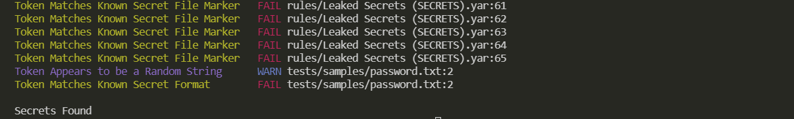

# Fides

_Fides - helping you keep secrets secret_

Fides is a secret-scanning tool designed to sift through code repositories to identify secrets that have been accidentally committed.

Leveraging the powerful [YARA](https://yara.readthedocs.io/en/v4.1.1/index.html) language, a tool of choice among security professionals and malware analysts for building detection and classification tools.

## Features

- Scans recursively through all files in a repository
- Utilizes YARA rules for high accuracy and customization
- Can be easily integrated into CI/CD pipelines

## Installation

Fides is intended to be run as a [GitHub Action](https://github.com/marketplace/actions/fides-secret-scanner). Please refer to the GitHub Action configuration examples below to integrate Fides into your workflow.

## Example GitHub Action Configuration

~~~yaml
# fides.yaml

name: Fides - helping you keep secrets secret

on: [push, pull_request]

jobs:
  fides:
    runs-on: ubuntu-latest
    steps:
      - name: Execute Fides Action
        uses: joocer/fides@main
~~~

## Example Output

## License 

[Apache 2.0](https://github.com/joocer/fides/blob/main/LICENSE)