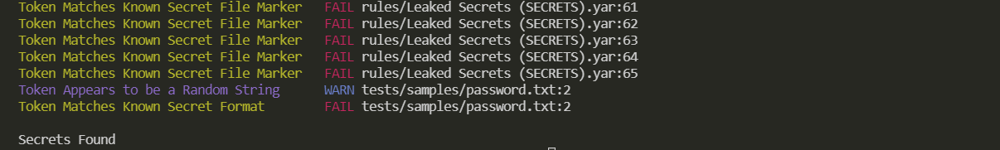

# Fides

_Fides - helping you keep secrets secret_

Fides is a secret-scanning tool designed to sift through code repositories to identify secrets that have been accidentally committed.

Leveraging the powerful [YARA](https://yara.readthedocs.io/en/v4.1.1/index.html) language, a tool of choice among security professionals and malware analysts for building detection and classification tools.

## Features

- Scans recursively through all files in a repository
- Utilizes YARA rules for high accuracy and customization
- Can be easily integrated into CI/CD pipelines
- Reports what matched, not just that something did - rule, pattern, position and a redacted preview
- Annotates the offending lines in the GitHub UI when run as an Action
- Optional JSON report (`--json report.json`) for downstream tooling

## What a Finding Looks Like

~~~
FAIL Cloud Provider Credential                tests/unit/connectors/test_s3_filesystem.py:34:15
     rule SECRETS04 [CLOUD_CREDENTIALS] | pattern $aws_access_key | importance high
     matched AKIA************MPLE (20 chars, redacted)
~~~

Each finding names the rule that fired (`SECRETS04`), the specific pattern within
it (`$aws_access_key`), and the `file:line:column` of the match. The matched value
is always redacted - Fides never copies a live credential into a build log.

Rules with an `importance` of `medium` or lower are reported as `WARN`, are not
listed unless `--verbose` is set, and never fail the scan. Everything else is a
`FAIL`. A summary at the end counts what was scanned and groups the failures by
type.

## Known Public Credentials

Some credentials are structurally real but belong to nobody - AWS's documented
SigV4 example pair, Azurite's fixed emulator key. Any repo with a test that
exercises those vendors contains them.

Fides does not pretend it never saw them. `SECRETS00` (`importance = "ignored"`)
matches these values; the other rules still run against the line, and their
findings are downgraded to `SKIP` and tagged with the allowlist entry that
excused them:

~~~
SKIP Cloud Provider Credential                tests/unit/connectors/test_s3_filesystem.py:34:15
     rule SECRETS04 [CLOUD_CREDENTIALS] | pattern $aws_access_key | importance high
     ignored by SECRETS00 ($known_public_aws_example_id)
     matched AKIA************MPLE (20 chars, redacted)
~~~

The count always appears in the summary, even without `--verbose`:

~~~
  ignored        1 known public (SECRETS00 ($known_public_aws_example_id))
~~~

This matters because a YARA pattern that dies never raises - it just stops
matching. Excluding these values inside a rule condition would make "we
recognised AWS's example key" and "`$aws_access_key` is broken and matches
nothing" produce identical output. Reporting the suppression keeps the two
distinguishable. Ignored findings do not fail the build and are not annotated
in the GitHub UI.

To allowlist a value in your own copy, add a string named `$known_public_*` to
`SECRETS00`.

## Installation

Fides is intended to be run as a [GitHub Action](https://github.com/marketplace/actions/fides-secret-scanner). Please refer to the GitHub Action configuration examples below to integrate Fides into your workflow.

## Example GitHub Action Configuration

~~~yaml
# fides.yaml

name: Fides - helping you keep secrets secret

on: [push, pull_request]

jobs:
  fides:
    runs-on: ubuntu-latest
    steps:
      - name: Execute Fides Action
        uses: joocer/fides@main
~~~

## Example Output

## License 

[Apache 2.0](https://github.com/joocer/fides/blob/main/LICENSE)